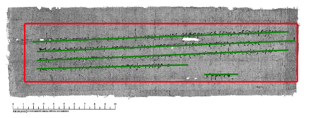
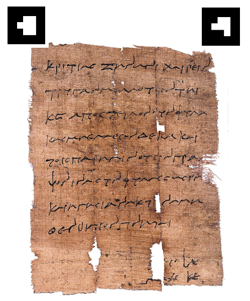
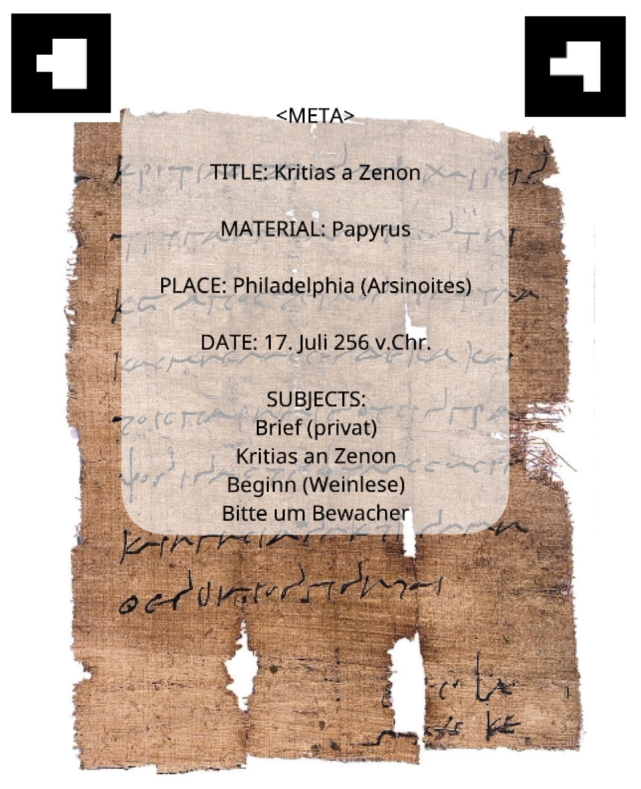
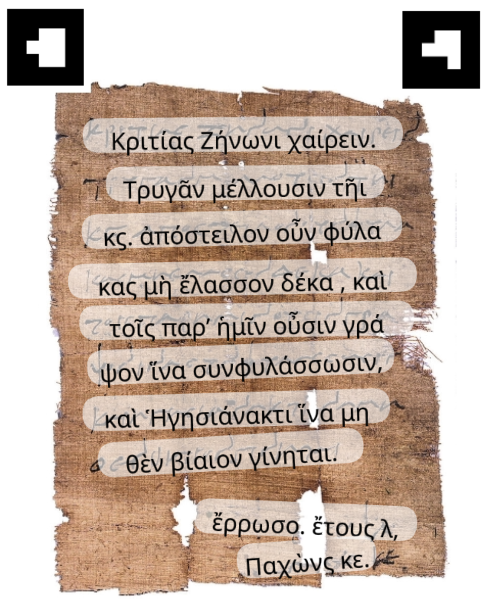

# Welcome to PapyriAR

## What is PapyriAR?

This project leverages the augmented reality framework ***[AR.js](https://ar-js-org.github.io/AR.js-Docs/)*** to create fun and easy to use AR experiences for papyri from the ***[Heidelberger Gesamtverzeichnis der Griechischen Papyrusurkunden Ägyptens (HGV)](https://aquila.zaw.uni-heidelberg.de/start)*** directly in the browser. We use transcription data saved in the ***[Duke Databank of Documentary Papyri (DDbDP)](https://papyri.info/docs/ddbdp)***  to display transcriptions on top of the original artifacts. This database allows to also display parts of the transcriptions that are lost to time and not visible on the papyri themselves anymore.

---

## Why is PapyriAR?

PapyriAR was created as part of the software practical **Research Software Engineering** at the ***[university of Heidelberg](https://www.uni-heidelberg.de/de)*** during the summer term 2024. As computer science students one of the aims of this project was to do some interdisciplinary work and look into different research fields at our university. For this project we were able to get some insights into the ***[Institute of Papyrology](https://www.uni-heidelberg.de/fakultaeten/philosophie/zaw/)***. We tried to create a tool that uses (semi) new technologies to interact with old artifacts in a new way. From the start, it was pretty clear that we should use an easy and lightweight AR framework because other disciplines naturally aren't super tech savvy. Using a framework that runs directly in the browser enables the maximum number of people and devices to use this project.

---

## Where does the data come from?

The collection of papyrological documents at ***[Papyri.info](https://papyri.info/)*** acts as the foundation of this project. Information about these artifacts and their transcriptions are stored and displayed in form of eXtensible Markup Language (*.xml*) files. These files are all collected in the Github repository ***[idp.data](https://github.com/papyri/idp.data)***. This makes it easy to access and use the data needed for this project. 

As we worked on this project the ***[Institute of Papyrology](https://www.uni-heidelberg.de/fakultaeten/philosophie/zaw/)*** worked on a eScriptorium project of their own, where they started to collect positioning data for the transcriptions of their papyri. Their data provides information on where the individual lines of the transcription should be positioned on the document.

*The image of **["Epharmostos a Zenon"](https://papyri.info/ddbdp/psi;4;331)** is licensed by the **[Heidelberger Gesamtverzeichnis der griechischen Papyrusurkunden Ägyptens](https://aquila.zaw.uni-heidelberg.de/start)** under **[CC BY 3.0](https://creativecommons.org/licenses/by/3.0/)**.*

This project sadly isn't available to the public yet, but the wonderful people at the ***[Institute of Papyrology](https://www.uni-heidelberg.de/fakultaeten/philosophie/zaw/)*** provided us with an early access. We used the data to display the individual transcription lines correctly on top of the original lines of the papyri.

---

## Example

As an example you can scan the following QR-Code and test it for yourself.

---

Try holding your camera over this image:

*The image of **["Kritias a Zenon"](https://papyri.info/ddbdp/psi;4;345)** is licensed by the **[Heidelberger Gesamtverzeichnis der griechischen Papyrusurkunden Ägyptens](https://aquila.zaw.uni-heidelberg.de/start)** under **[CC BY 3.0](https://creativecommons.org/licenses/by/3.0/)**.*

---

The result should look something like this:

*The image of **["Kritias a Zenon"](https://papyri.info/ddbdp/psi;4;345)** is licensed by the **[Heidelberger Gesamtverzeichnis der griechischen Papyrusurkunden Ägyptens](https://aquila.zaw.uni-heidelberg.de/start)** under **[CC BY 3.0](https://creativecommons.org/licenses/by/3.0/)**.*

---

If you change the checkbox in the top left, you should see:

*The image of **["Kritias a Zenon"](https://papyri.info/ddbdp/psi;4;345)** is licensed by the **[Heidelberger Gesamtverzeichnis der griechischen Papyrusurkunden Ägyptens](https://aquila.zaw.uni-heidelberg.de/start)** under **[CC BY 3.0](https://creativecommons.org/licenses/by/3.0/)**.*

---

## Where to start

The best place to start is the documentation of this project. You can find it at ***[Documentation](https://thorsten-trinkaus.github.io/PapyriAR/)***.

If you are interested in using our project, you should visit our ***[User Guide](https://thorsten-trinkaus.github.io/PapyriAR/docs/user/Introduction)***. There we provide a detailed guide on how to create PapyriAR visualizations and how to use already existing ones. 

If you are more interested in the technical side of this project and want to understand how it works, please take a look at our ***[Developer Guide](https://thorsten-trinkaus.github.io/PapyriAR/docs/dev/Introduction)***.

---

## Special Thanks

We want to directly thank all the lovely people over at the ***[Institute of Papyrology](https://www.uni-heidelberg.de/fakultaeten/philosophie/zaw/)*** for their time, coffee and help on understanding their database!