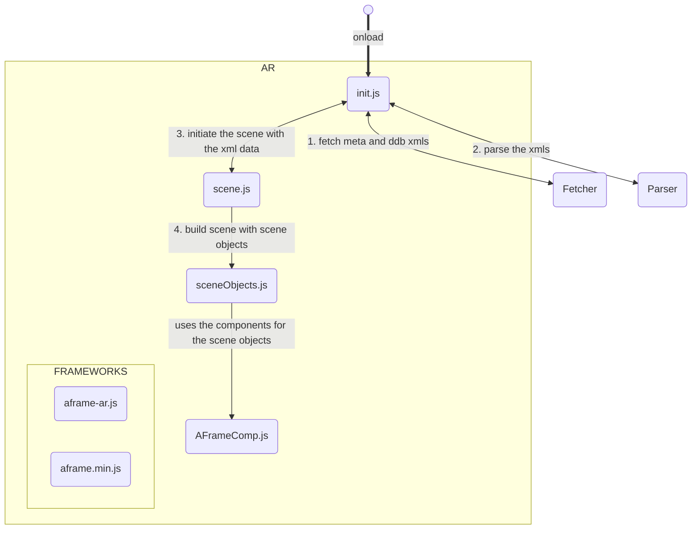
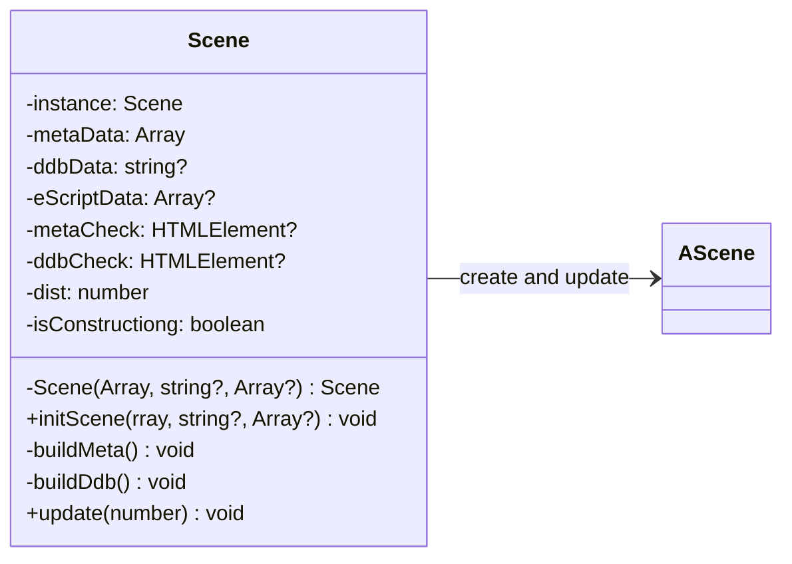
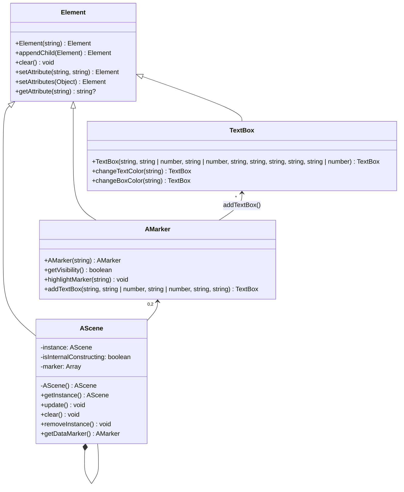

# AR



This is the heart of our project, as it handles everything related to the augmented reality experience, from building the scene to actually displaying the data in the AR environment. Before we can understand how the scene is composed, we first need to take a look at the frameworks we used for the AR part of this project.

---

## Frameworks

From the start, we knew we wanted this project to be lightweight and portable. Running the AR experience directly in the browser not only makes it easy for us to provide the service, but also makes it easier for the user to access our project. We first tried image recognition based augmented reality in an attempt to minimize the number of components needed for a visualization. We soon realized that this isn't an option, as the papyri do not offer enough visual diversity in shape and color for the AR part to recognize the artifacts consistently in real time. Image recognition is also very computationally expensive, which also didn't make it very practical, as the tested mobile devices got hot fast. The next logical step was to try marker based augmented reality. Markers are simple and easy to recognize, which reduced the computing expense, while also boosting the consistency of the experience.

What does this have to do with the used framework? Well, it turns out that there is really only one framework that supports browser based augmented reality with marker tracking. This is why we use ***[AR.js](https://ar-js-org.github.io/AR.js-Docs/)***, which handles the augmented reality aspect.

***[AR.js](https://ar-js-org.github.io/AR.js-Docs/)*** in itself uses a different framework called ***[AFrame](https://aframe.io/)***. This is an open source project for building browser based VR scenes. **AR.js** uses this framework to create VR scenes and adapts them from the virtual to the augmented reality. Naturally, our scenes are composed of **AFrame** elements and components. 

---

## Init

Scanning the QR-Code to a PapyriAR visualization will redirect the user to `https://thorsten-trinkaus.github.io/PapyriAR/AR`. There, the onload function of the HTML body triggers the `init()` function of the ***[init.js](../jsDoc/init.md)*** file. This function fetches and parses the data to display on top of the papyrus with the help from ***[Fetcher](./Fetcher.md)*** and ***[Parser](./Parser.md)***. After gathering all the needed data, this instantiates the scene with the data. The Trismegistos identifier and the eScriptorium data is provided through the `data` query parameter.

For more information about the initiation, look at ***[init.js](../jsDoc/init.md)***.

---

## Scene



The `Scene` class in the ***[scene.js](../jsDoc/scene.md)*** file functions as a singleton. The special part is, that it doesn't provide a way to access the singleton instance from outside the class. The only way to interact with the Scene is through the static methods. The instance is instantiated by the ***[init.js](../jsDoc/init.md)*** file. The provided data is displayed in the AR context, by using Scene Objects from the ***[sceneObjects.js](../jsDoc/sceneObjects.md)*** file. This will be discussed in the next section!.

The Scene instance can only be instantiated once. At the construction of the instance, the class checks the provided data. If meta, ddb and eScriptorium data are present, the Scene object creates a quick UI interface to change between meta and transcription data.

For more information about the scene, look at ***[scene.js](../jsDoc/scene.md)***.

---

## Scene Objects



The objects that are placed into the scene are designed with an object orientation in mind. They mimic normal **HTMLELment**s, as they are supposed to be used in a familiar way. This allows easy integration of the **AFrame** elements into the HTML document, while still providing extra features for the different Object classes.
Each of these classes (without the base class Element) represent a specific AFrame element:

### AScene

This class represents an `<a-frame>` element. Because there should only be one `<a-frame>` element, this class is designed as a singleton.
All assets in the scene are later attached to this scene element. This could look like this:

```HTML
<a-scene>
  <a-assets>
    
  </a-assets>

  <a-box src="#texture"></a-box>
</a-scene>
```

For the element to work in the AR context, there need to be specific attributes set and a camera element needs to be attached, which would look like this:

```HTML
<a-scene embedded arjs="sourceType: webcam;">
  <a-assets>
    
  </a-assets>

  <a-box src="#texture"></a-box>

  <a-entity camera></a-entity>
</a-scene>
```

### AMarker

This class represents a `<a-marker>` element. A scene like the one above, would always display the attached data. We want to only display data if the marker we use is visible. For this we need to add a marker to the scene and then attach the data elements to this marker. There are multiple marker types that can be used with **AR.js**. We decided on using *"barcode"* markers. These are auto-generated markers, from matrix computations. They are ready to use and there exists a wide range of barcode markers. You can see a collection of barcode markers ***[here](https://github.com/nicolocarpignoli/artoolkit-barcode-markers-collection)***. This project only uses two marker from the *"3x3"* set, value 0 and value 1.
A 3x3 barcode marker with value 0 would look something like this:

```HTML
<a-marker type="barcode" value="0">
  <a-box src="#texture"></a-box>
</a-marker>
```

To enable the marker recognition we also need to add stuff to the `<a-scene>` element:

```HTML
<a-scene embedded arjs="sourceType: webcam; detectionMode: mono_and_matrix; matrixCodeType: 3x3;">
  <a-marker type="barcode" value="0">
    <a-box src="#texture"></a-box>
  </a-marker>

  <a-entity camera></a-entity>
</a-scene>
```

Now, the `<a-box>` element is only visible, when the marker is recognized. The element is positioned and scaled relative to the marker element. The width / height of the marker is set as base length 1 for any element attached to it.

### TextBox

This class represents a custom `<a-entity>` element, which is a composition of a plane and a AFrame ***[text component](https://aframe.io/docs/1.6.0/components/text.html#main)*** on top on this plane. Such an entity would look like this:

```HTML
<a-entity geometry="primitive: plane; width: 0; height: 0;" position="0 0 0" material="depthTest: false;" text="value: hello world; width: 5;"></a-entity>
```

The `depthTest: false;` is needed to avoid z-fighting between the plane and the text component. A complete scene would look like this:

```HTML
<a-scene embedded arjs="sourceType: webcam; detectionMode: mono_and_matrix; matrixCodeType: 3x3;">
  <a-marker type="barcode" value="0">
    <a-entity geometry="primitive: plane; width: 0; height: 0;" position="0 0 0" material="depthTest: false;" text="value: hello world; width: 5;"></a-entity>
  </a-marker>

  <a-entity camera></a-entity>
</a-scene>
```
---

In js, with the help of our classes, this would look like this:

```js
const scene = AScene.getInstance();
// This will internally create the AScene instance and will also attach two markers to this instance.

const marker = scene.getDataMarker()

const textBox = marker.addTextBox("hello", 5, 5, "0 0 0", "0 0 0",);
// This will add text to one of the markers.
// Scanning the second marker will not display this text.
```

(This will obviously add more stuff than the elements we have shown before.) For more information about the scene objects, look at ***[sceneObjects.js](../jsDoc/sceneObjects.md)***.

---

## Custom AFrame Components

AFrame allows the creation of custom ***[AFrame components](https://aframe.io/docs/1.6.0/introduction/writing-a-component.html#main)***. These components can be registered using javaScript and then set as Attributes for the AFrame elements of the scene.

```js
AFRAME.registerComponent("calibration", 
    {
        // Property of given type.
        schema: {type: "type"},

        init: function ()
        {
            // Is only called once 
        },

        tick: function ()
        {
            // Is called every frame.
        }
    }
);
```

A **schema** defines the properties of the component. 

We can define lifecycle handler methods for the component:
- **.init()** is called once after the component is first attached to the entity.
- **.tick()** is called every frame.

We have written two of these components to be used in the project:

- **calibration**: This component can be attached to a `<a-marker>` element and it needs a query selector for another marker as the parameter.
This component uses the **.tick()** method to compute the distance between these two markers for every frame. This distance is set as a "dist" attribute for the marker this is attached to.

```js
const marker1 = new AMarker("1");
const marker2 = new AMarker("2");
marker1.setAttribute("id", "m1");
marker2.setAttribute("calibration", "#m1");
```

- **rounded**: This component can be attached to the `<a-entity>` element of the TextBox. It only calls its **.init()** method once, which manipulates the geometry of the plane, such that the edges of the text box are rounded.

The constructor of the TextBox class automatically attaches this component to the element.

For more information about the custom components, look at ***[AFrameComp.js](../jsDoc/AFrameComp.md)***.