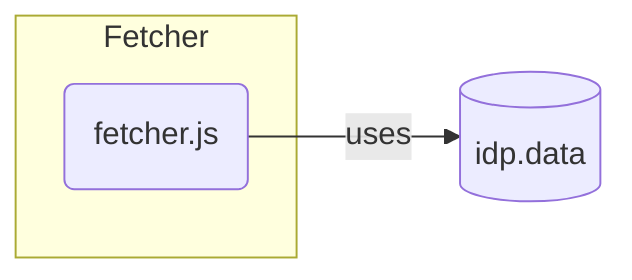

# Fetcher

The fetcher is a simple but irreplaceable component for this project. The file *"fetcher.js"* offers the rest of the project the possibility to retrieve various URLs via the ***[Fetch API](https://developer.mozilla.org/en-US/docs/Web/API/Fetch_API)***. It also allows to customize the request payload for the fetch. While the file offers the possibility to fetch any custom URL, it also provides a simple and fast way to fetch the needed meta and ddb data directly by only providing Trismegistos and hybrid-ddb identifier instead of an URL.

---

For more information about the fetcher, take a look at ***[fetcher.js](../jsDoc/fetcher.md)***.