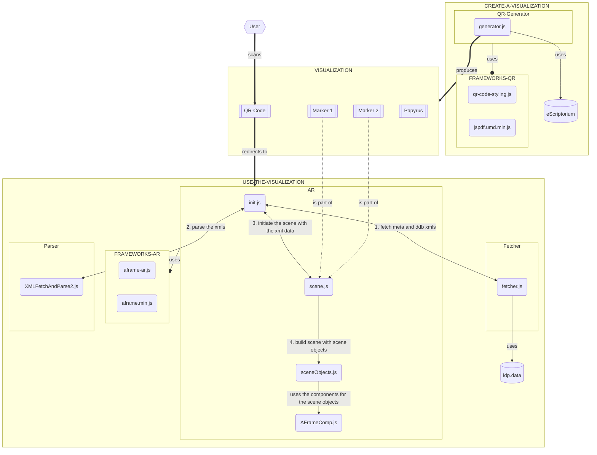

# Introduction

**Welcome to the PapyriAR Developer Guide**. This guide is designed to give a detailed explanation on how this project works. To get an idea on what this project is and how users interact with it, start with the ***[User Guide](../user/Introduction.md)***. We will assume that you have basic knowledge of this project.

---

The following flowchart should give you a rough idea of the projects inner workings. In the chapters of the **Developer Guide**, we will take a close look at the individual parts of this chart.
 


---

## Where do we get the data from?


Before we start start explaining how our project works, we should quickly discuss the data we use. We decided on only using data from the ***[Heidelberger Gesamtverzeichnis der Griechischen Papyrusurkunden Ägyptens (HGV)](https://aquila.zaw.uni-heidelberg.de/start)***. These papyri can be accessed through ***[papyri.info](https://papyri.info)***. The pieces of information about the papyri available at ***[papyri.info](https://papyri.info)*** are stored in eXtensible Markup Language (*.xml*) form. There are two files that we are interested at:

- First there is a *.xml* file which hold useful metadata about the papyrus in question. This file can be identified by the ***[Trismegistos](https://www.trismegistos.org/) identifier*** of the papyrus. We use this *.xml* for information about title, place of origin, material, estimated date of creation and tags that describe the subject of the papyrus.

- The second *.xml* file holds the papyrus transcription from the ***[Duke Databank of Documentary Papyri (DDbDP)](https://papyri.info/docs/ddbdp)***. This can be identified by a **hybrid-ddb identifier**. Luckily this identifier can be obtained from the first file.

Let's look at the example of the Papyrus ***["O.Edfou Copte 95"](https://papyri.info/ddbdp/apf;57;95_95)***.

- The meta *.xml* looks like this:

```xml
<?xml version="1.0" encoding="UTF-8"?>
<?xml-model href="https://epidoc.stoa.org/schema/8.13/tei-epidoc.rng" type="application/xml" schematypens="http://relaxng.org/ns/structure/1.0"?>
<TEI xmlns="http://www.tei-c.org/ns/1.0">
  <teiHeader>
      <fileDesc>
         <titleStmt>
            <title>O.Edfou Copte 95</title>
         </titleStmt>
         <publicationStmt>
            <idno type="filename">131697</idno>
            <idno type="TM">131697</idno>
            <idno type="ddb-filename">apf.57.95_95</idno>
            <idno type="ddb-hybrid">apf;57;95_95</idno>
         </publicationStmt>
         <sourceDesc>
            <msDesc>
               <msIdentifier>
                  <placeName>
                     <settlement>Cairo</settlement>
                  </placeName>
                  <collection>IFAO</collection>
                  <idno type="invNo">O. Edfou C. 25</idno>
               </msIdentifier>
               <physDesc>
                  <objectDesc>
                     <supportDesc>
                        <support>
                           <material>Ostrakon</material>
                        </support>
                     </supportDesc>
                  </objectDesc>
               </physDesc>
               <history>
                  <origin>
                     <origPlace>Apollonopolis</origPlace>
                     <origDate notBefore="0601" notAfter="0700" precision="low">VII</origDate>
                  </origin>
                  <provenance type="located">
                     <p xml:id="geoDGEB4H">
                        <placeName type="ancient"
                                   ref="https://pleiades.stoa.org/places/785974 https://www.trismegistos.org/place/269">Apollonopolis</placeName>
                     </p>
                  </provenance>
               </history>
            </msDesc>
            <listBibl>
               <bibl type="SB">
                  <ptr target="http://papyri.info/biblio/79722"/>
                  <biblScope type="pp">95</biblScope>
               </bibl>
            </listBibl>
         </sourceDesc>
      </fileDesc>
      <encodingDesc>
         <p>This file encoded to comply with EpiDoc Guidelines and Schema version 8</p>
      </encodingDesc>
      <profileDesc>
         <langUsage>
            <language ident="fr">Französisch</language>
            <language ident="en">Englisch</language>
            <language ident="de">Deutsch</language>
            <language ident="it">Italienisch</language>
            <language ident="es">Spanisch</language>
            <language ident="la">Latein</language>
            <language ident="el">Griechisch</language>
         </langUsage>
         <textClass>
            <keywords scheme="hgv">
               <term n="1">Quittung (?)</term>
               <term n="2">Zahlung</term>
               <term n="3">Geld</term>
            </keywords>
         </textClass>
      </profileDesc>
      <revisionDesc>
         <change when="2022-01-25T05:35:36-05:00"
                 who="http://papyri.info/editor/users/james.cowey">Finalized - Ready.</change>
         <change when="2022-01-25T05:05:53-05:00"
                 who="http://papyri.info/editor/users/james.cowey">Vote - HGVAccept - Fine</change>
         <change when="2022-01-24T16:37:23-05:00"
                 who="http://papyri.info/editor/users/LaviniaFerretti">Submit - For the sake of uniformisation, corrected mistake in Metadata &gt; Publication</change>
         <change when="2021-05-18T12:53:24-04:00"
                 who="http://papyri.info/editor/users/james.cowey">Finalized - Ready.</change>
         <change when="2021-05-18T07:06:03-04:00"
                 who="http://papyri.info/editor/users/james.cowey">Vote - HGVAccept - Fine</change>
         <change when="2021-05-17T12:10:38-04:00"
                 who="http://papyri.info/editor/users/OrestesSimakou">Submit - I am submitting the O.Edfou Copte 95 metadata and text.</change>
         <change when="2021-05-15T08:12:13-04:00" who="http://papyri.info/editor">Automated creation from template</change>
      </revisionDesc>
  </teiHeader>
  <text>
      <body>
         <div type="bibliography" subtype="principalEdition">
            <listBibl>
               <bibl type="publication" subtype="principal">
                  <title level="s" type="abbreviated">APF</title>
                  <biblScope n="1" type="volume">57</biblScope>
                  <biblScope n="2" type="fascicle">(2011)</biblScope>
                  <biblScope n="3" type="pages">S. 95</biblScope>
                  <biblScope n="4" type="number">Nr. 95</biblScope>
               </bibl>
            </listBibl>
         </div>
         <div type="bibliography" subtype="illustrations">
            <p>
               <bibl type="illustration">O.EdfouIFAO S. 133</bibl>
            </p>
         </div>
         <div type="bibliography" subtype="otherPublications">
            <listBibl>
               <bibl type="publication" subtype="other">O.EdfouIFAO 95</bibl>
            </listBibl>
         </div>
      </body>
  </text>
</TEI>
```

- The ddb *.xml* looks like this:

```xml
<?xml version="1.0" encoding="UTF-8"?>
<?xml-model href="https://epidoc.stoa.org/schema/8.16/tei-epidoc.rng" type="application/xml" schematypens="http://relaxng.org/ns/structure/1.0"?>
<TEI xmlns="http://www.tei-c.org/ns/1.0" xml:lang="en">
  <teiHeader>
      <fileDesc>
         <titleStmt>
            <title>apf.57.95_95</title>
         </titleStmt>
         <publicationStmt>
            <authority>Duke Collaboratory for Classics Computing (DC3)</authority>
            <idno type="filename">apf.57.95_95</idno>
            <idno type="ddb-hybrid">apf;57;95_95</idno>
            <idno type="HGV">131697</idno>
            <idno type="TM">131697</idno>
            <availability>
               <p>© Duke Databank of Documentary Papyri. This work is licensed under a
          <ref type="license" target="http://creativecommons.org/licenses/by/3.0/">Creative 
          Commons Attribution 3.0 License</ref>.</p>
            </availability>
         </publicationStmt>
         <sourceDesc>
            <p>
               <bibl>APF 57 95_95</bibl>
            </p>
         </sourceDesc>
      </fileDesc>
      <profileDesc>
         <langUsage>
            <language ident="en">English</language>
            <language ident="grc">Greek</language>
         </langUsage>
      </profileDesc>
      <revisionDesc>
          <change when="2021-05-19T06:04:13-04:00"
                 who="https://papyri.info/editor/users/james.cowey">Finalized - Ready.</change>
          <change when="2021-05-18T15:09:15-04:00"
                 who="https://papyri.info/editor/users/james.cowey">Vote - Accept-Straight-to-Finalization - Fine</change>
          <change when="2021-05-15T08:12:13-04:00" who="http://papyri.info/editor">Automated creation from template</change>
      </revisionDesc>
  </teiHeader>
  <text>
      <body>
         <head xml:lang="en"/>
         <div xml:lang="grc" type="edition" xml:space="preserve">
<ab>
    <lb n="1"/><g type="stauros"/> <expan>Κόλλουθ<ex>ος</ex></expan> <expan>Βασιλ<ex>είου</ex></expan> <expan>δ<ex>ιὰ</ex></expan> <app type="alternative"><lem>Ἰσακ</lem><rdg><expan>Ἰσακ<ex>ίου</ex></expan></rdg></app>

    <lb n="2"/><abbr>εξ<gap reason="illegible" quantity="2" unit="character"/></abbr> <expan>χρυ<ex>σοῦ</ex></expan> <expan><ex>νοµίσµατος</ex></expan> <num value="3" rend="tick">γ</num> <num value="12" rend="tick">ιβ</num> <choice><reg>τρίτον</reg><orig>τρίδον</orig></choice> <choice><reg>δωδέκατον</reg><orig>τοδέκ<supplied reason="lost">α</supplied><add place="below">τον</add></orig></choice> 

    <lb n="3"/><gap reason="illegible" quantity="2" unit="character"/> <expan>ἰ<ex>ν</ex>δ<ex>ικτίωνος</ex></expan> <num value="2">β</num> Απαι<gap reason="illegible" quantity="1" unit="character"/> <expan>στοιχ<ex>εῖ</ex></expan> <gap reason="lost" extent="unknown" unit="character"/> <g type="stauros"/>
</ab>
      </div>
      </body>
  </text>
</TEI>
```

These files are not only saved at ***[papyri.info](https://papyri.info)***, but also at the ***[GitHub Repository: idp.data](https://github.com/papyri/idp.data)***. This makes it especially easy to automatically access them. There are two folders in the repository that we need:

- ***[HGV_meta_EpiDoc](https://github.com/papyri/idp.data/tree/master/HGV_meta_EpiDoc)***: Here, the meta *.xml* files are stored in batches of 1000 by their Trismegistos identifier.

- ***[DDB_EpiDoc_XML](https://github.com/papyri/idp.data/tree/master/DDB_EpiDoc_XML)***: Here, the ddb *.xml* files are stored by their hybrid-ddb identifier.

As you may already have noticed from the example, the ddb *.xml* stores the transcription line by line. The problem is that this file doesn't store any information about the position of the individual lines on the original artifact. We need this information to correctly display the transcription on top of the papyrus.

There is a ***[eScriptorium database](https://serv50.ub.uni-heidelberg.de/)*** that solves this problem. This project is still work in progress and isn't yet available to the pubic, so we don't want to show an example file here. This database also stores *.xml* files. Each of these is directly connected to an image of a papyrus. The files store pixel coordinates for the line positions in these images. Although we have access to this database and it has an API, this API **doesn't allow for Cross-Origin Resource Sharing (CORS)**. Consequently, this data can't be accessed at runtime and must be provided by the user via the ***[QR-Code generator](https://thorsten-trinkaus.github.io/PapyriAR/QR-Generator/)***.