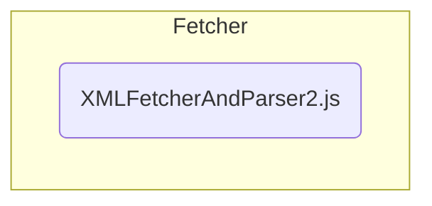

# Parser

The Parser is even simpler than the Fetcher. The purpose of the **"XMLFetcherAndParser2.js"** file is to parse the meta and ddb *.xml* files we use for this project. The file uses the ***[DOMParser API](https://developer.mozilla.org/en-US/docs/Web/API/DOMParser)*** to parse these files. For more information about the structure of the *.xml* files look at the ***[Introduction](./Introduction.md#where-do-we-get-the-data-from)***.

---