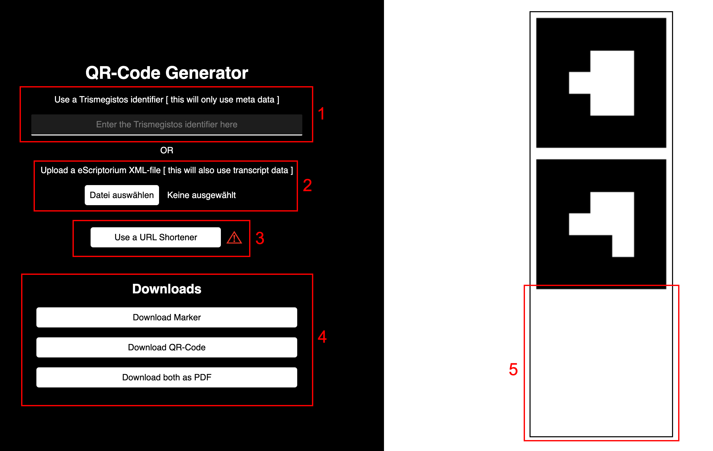
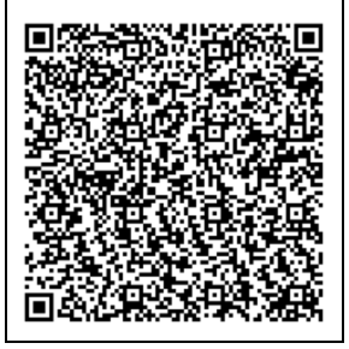

# Creating a new visualization

This chapter provides a step by step tutorial on how to create a new visualization for any papyrus from the ***Heidelberger Gesamtverzeichnis der Griechischen Papyrusurkunden Ägyptens (HGV)***. If you already know how to create one, you can skip to the ***[next chapter](SetUp)***, which explains how to set up a newly created visualization.
If you are just interested in using an already existing visualization go to ***[Using](Using)***.

---

## Where do I start?

As stated in the ***[introduction](Introduction)***, the visualization for any papyrus consists of three parts. While the marker stay constant for all papyri, the QR-Code needs to be generated for each papyrus individually. We offer an easy to use ***[tool](https://thorsten-trinkaus.github.io/PapyriAR/QR-Generator)*** for creating the QR-Code.

### Generate a QR-Code

There are two ways in which our too is able to create a QR-Code. The first option is to generate the QR-Code through the **Trismegistos identifier** of the papyrus you want to visualize. This is simply done by entering the identifier into the textbox **[<text class="redText">1</text>]**. While this option is fast and simple, it is also limited in its visualization capabilities. The created visualization will only display the meta data of the Papyrus, instead of overlaying the transcription.

The alternative is to use **eScriptorium** data of the papyrus you want to visualize. If you have access to the ***[eScriptorium database](https://serv50.ub.uni-heidelberg.de/)***, all you need to do is to download the *.xml* file for the papyrus and upload it to the tool **[<text class="redText">2</text>]**. We **do not** save any file you upload! At the time of creating this tool, there is a mixture of handcrafted and automatically generated *.xml* files in the eScriptorium database. For now it only works with the handcrafted files. Don't worry, if you can't tell whether your file can be used or not. Just try to upload it. If it can't be used, the tool will alert you to upload a different file. The visualization created through this method will also display the transcription of the papyrus.

Only one of these options can be used at once. If you already uploaded a *.xml* file, but want to use the first method, you can remove the file by pressing the **<text class="redText">X</text>** button.

### Did it work?

If everything worked, you should see a preview of the QR-Code on the right side **[<text class="redText">5</text>]**.

With Trismegistos identifier ***"1"***                          | With eScriptorium file for Trismegistos identifier ***"2020"***
:------------------------------------------------------------:|:------------------------------------------------------------:
                      | 

You might notice that the QR-Codes can get very large and complex, especially if the eScriptorium method is used. This is because the URL encoded in the QR-Code needs to store more information. This naturally makes them harder to read for your mobile device, requiring you to print large versions of the QR-Code, for them to still be usable. To counter this problem we decided to use a URL shortener. This is an optional step. You can skip the next section, if you don't want to shorten the URL.

### Shorten the URL for easy to read QR-Codes

We use the open source URL shortener ***[spoo.me](https://spoo.me)***. Before you use this function, you should consider that we don't control this service. We can't guarantee that the URLs (and therefore QR-Codes) created through ***[spoo.me](https://spoo.me)*** will stay active and keep working in the future. Although ***[spoo.me](https://spoo.me)*** is an open source project, we also can't rule out that you might get tracked if you use this service.

If you still want to use the URL shortener, wait until you see the preview of your QR-Code and press the shortener button **[<text class="redText">3</text>]**.

### Downloads

You just generated a new QR-Code. The last step to take is to download **marker** and **QR-Code** **[<text class="redText">4</text>]**.

- Both marker can be downloaded at once through
the **"Download Marker"** button. This can be done any time and the marker will be downloaded as *.png* files.

- The QR-Code can be downloaded through the **"Download QR-Code"** button. This is possible as soon as you see the preview of your QR-Code. The QR-Code will also be downloaded as a *.png*.

- You can also download both marker and the QR-Code together through the **"Download both as PDF"** button. This will download a *.pdf* file with all three images. This is also possible as soon as you see the preview.

---

## What next?

In the next chapter we will explain how to set up the visualization you just downloaded the components for.