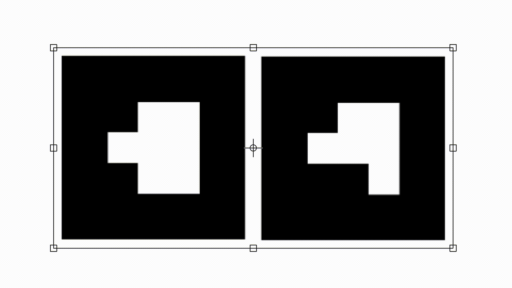
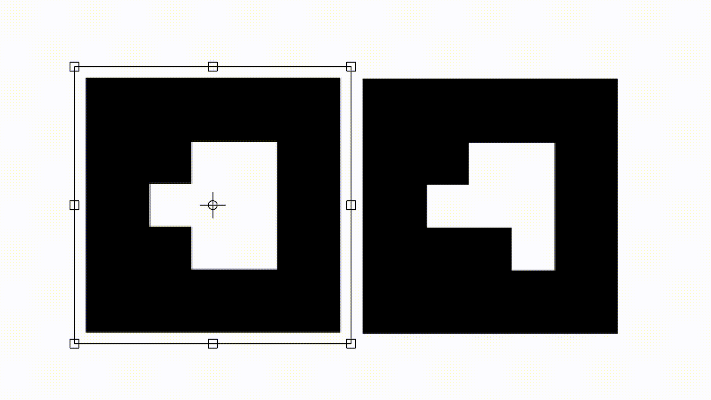
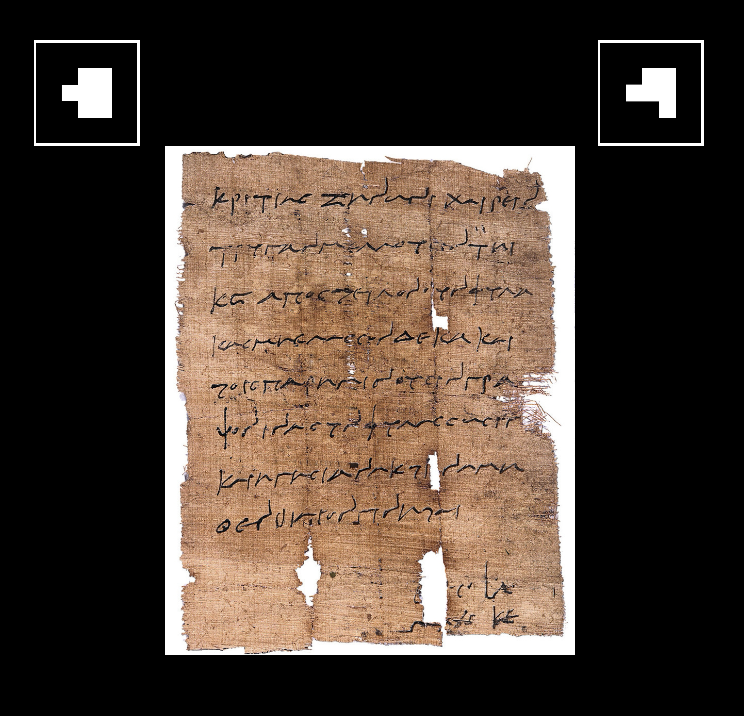
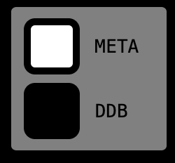

# Setting up the new visualization

So you just generated a QR-Code and downloaded both marker and the new QR-Code? This chapter should provide a explanation on how to set up the three components, such that the visualization can be used by any user.

---

## Printing

The first step in the setup process is to print all three components. **There are two very important things to note here!**

- The white border around the marker **is** part of the maker. It is important for the readability of the maker, while using the visualization against a dark background.

- Both marker need to be printed at the same size. As long as both marker have the same size, the overall size of both marker can be adjusted to your liking. You can try different sizes until you find what works best for you. **Keep in mind that larger marker equal easier readability**.

***Do***                                              | ***Don't***
:----------------------------------------------------:|:----------------------------------------------------:
              | 

The size of the QR-Code doesn't matter as the QR-Code just redirects to the visualization and is not directly involved in displaying data in the AR space. Just make sure that it is still readable with your mobile device.

---

## Calibration

This is the important part of the setup process. In this step we will position the marker, such that the transcription is displayed correctly on top of the papyrus you want to visualize. Place the marker with value *0* on the top left of your papyrus and place the marker with value *1* on the top right.
**Make sure they are aligned horizontally!**

*The image of **["Kritias a Zenon"](http://papyri.info/ddbdp/psi;4;345)** is licensed by the **[Heidelberger Gesamtverzeichnis der griechischen Papyrusurkunden Ägyptens](https://aquila.zaw.uni-heidelberg.de/start)** under **[CC BY 3.0](https://creativecommons.org/licenses/by/3.0/)**.*

Now use your mobile device to scan the QR-Code you generated in the last chapter. This is the same way the user will interact with the visualization later.
**If you are prompted to do so, make sure that you allow access to camera and motion sensors!** After loading change the displaying mode to *"ddb"*, which will display the transcription of your papyrus. You can do this by hitting the checkbox on the top left of your screen. **If you have chosen to use a Trismegistos identifier while creating the QR-Code, the visualization will only display meta data and the checkboxes will not be visible. In this case you can just continue with the [Horizontal alignment](#horizontal-alignment).**

### Horizontal alignment

Use your mobile device to look at the visualization by holding the camera in front of the two marker and the papyrus. Now align the scale and horizontal position of the AR transcript by moving the marker horizontally. Move both of them until you are happy with the result. The transcript doesn't need to be vertically aligned yet.
**Try to keep both marker on the same horizontal line.** If you run into any problems with the AR overlay at this point onward, please take a look at the ***[Troubleshooting](./Using.md#troubleshooting)*** section of the ***[Using PapyriAR](Using)*** chapter.

*The image of **["Kritias a Zenon"](http://papyri.info/ddbdp/psi;4;345)** is licensed by the **[Heidelberger Gesamtverzeichnis der griechischen Papyrusurkunden Ägyptens](https://aquila.zaw.uni-heidelberg.de/start)** under **[CC BY 3.0](https://creativecommons.org/licenses/by/3.0/)**.*

### Vertical alignment

Now we want to do the same, but for the vertical alignment. Since the scale of the displayed transcript is already aligned with the papyrus, you only need to move both marker up or down simultaneously.

*The image of **["Kritias a Zenon"](http://papyri.info/ddbdp/psi;4;345)** is licensed by the **[Heidelberger Gesamtverzeichnis der griechischen Papyrusurkunden Ägyptens](https://aquila.zaw.uni-heidelberg.de/start)** under **[CC BY 3.0](https://creativecommons.org/licenses/by/3.0/)**.*

---

## Finishing touch

You are almost done. All you have to do now, is to fixate both marker in their place. The last step is to place the QR-Code wherever you want.

**Congratulation!** You did it. You created a visualization for your papyrus. 

You want to change what is displayed? Look into our ***[Developer Guide](../dev/Introduction.md)*** to change this project to better fit your own needs.