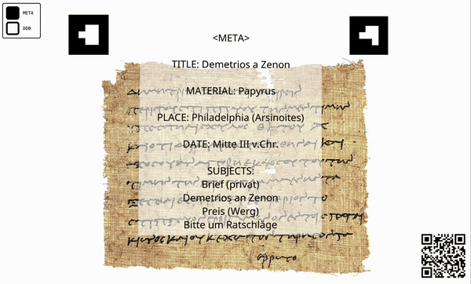

# Using PapyriAR

In this chapter we will teach you how to use an existing PapyriAR visualization. For the sake of simplicity, this chapter assumes that a correctly set up visualization is already available. If you are interested in creating a new visualization for one of your papyri, you should start ***[here](Create)***.

---

We tried to make using an already existing PapyriAR visualization as easy as possible. All you will need in the process is a mobile device with a camera and an internet connection *(e.g. your smartphone or tablet)*. There are only three big components to consider while using this project, as mentioned before in the ***[introduction](intro)*** to this guide.

QR-Code                   | Marker 1                 | Marker 2
:------------------------:|:------------------------:|:------------------------:
|  | 

With these three parts a PapyriAR visualization should look something like this:

*The image of **["Demetrios a Zenon"](https://papyri.info/ddbdp/psi;4;404)** is licensed by the **[Heidelberger Gesamtverzeichnis der griechischen Papyrusurkunden Ägyptens](https://aquila.zaw.uni-heidelberg.de/start)** under **[CC BY 3.0](https://creativecommons.org/licenses/by/3.0/)**.*

---

## Scanning the QR-Code

Before you can use the visualization, you need to scan the QR-Code with your mobile device. The QR-Code should automatically redirect you to the PapyriAR web page. If you are not redirected, just try again. The web page might ask you for permission to use your camera and motion sensors. **Make sure to accept all prompts to ensure the page working correctly!**

---

## Displayed data

If everything works, you should see the input from the camera of your mobile device. The web page should now display some information about the papyrus in front of you while viewing **Marker 1**.

*The image of **["Demetrios a Zenon"](https://papyri.info/ddbdp/psi;4;404)** is licensed by the **[Heidelberger Gesamtverzeichnis der griechischen Papyrusurkunden Ägyptens](https://aquila.zaw.uni-heidelberg.de/start)** under **[CC BY 3.0](https://creativecommons.org/licenses/by/3.0/)**.*

---

The data displayed consists of meta data connected to the papyrus you are looking at. This includes the title of the artefact, the material of the document, the place it was found, the estimated date of creation and some tags describing the context of the text. At the moment, this data is only provided in german. For some Papyri this currently is the only information available for us to practically use, even if the transcription is available at ***[papyri.info](https://papyri.info)***. In this case the meta data will be the only data displayed through our visualization.

If there is transcription data available for the papyrus you are looking at, you will find checkboxes in the top left corner of your screen, where you as the user can easily toggle between displaying meta data and the actual transcript.

*The image of **["Demetrios a Zenon"](https://papyri.info/ddbdp/psi;4;404)** is licensed by the **[Heidelberger Gesamtverzeichnis der griechischen Papyrusurkunden Ägyptens](https://aquila.zaw.uni-heidelberg.de/start)** under **[CC BY 3.0](https://creativecommons.org/licenses/by/3.0/)**.*

---

## Troubleshooting

To avoid frustration while using our project, we want to address some issues you might run into:

### Why is the data so small? / Why does the transcript not overlay with the papyrus?

This issue might occur if you only have **Marker 1** visible to the camera of your mobile device. Try to cover both marker at the same time. This will recompute the distance between the marker, which should trigger the visualization to realign itself with the papyrus. This should also fix sizing issues.

### Why is the visualization flickering / not showing at all?

There are multiple factors which contribute to the consistency of the experience. Changing the background behind the papyrus might already solve your problem, as the AR framework used, sometimes struggles to recognize the marker if the background is too dark or if the lighting conditions are bad. Also make sure that both marker are clean and not obscured by anything.

If these solutions don't work for you, please consider copying the URL over to a different browser and trying again. Sometimes the AR framework has some browser (version) specific problems we can't resolve.

If you the visualization still doesn't work, try holding your mobile device closer to the papyrus (while still covering the marker). This might sound trivial, but the closer you get with your camera, the bigger the marker appear, which makes it easier for the framework to detect their position.

### Why is the data displayed at a strange angle?

The AR framework we use sometimes fails to correctly calculate the rotation of the marker. Try to reload **Marker 1** by moving the camera away from the papyrus, such that the marker isn't covered anymore and moving it back afterwards. If this doesn't work try to reload the web page.

### Still got a question?

Feel absolutely free to write as an ***[E-Mail](../contact.md)***. Together we might be able to solve the problem.
